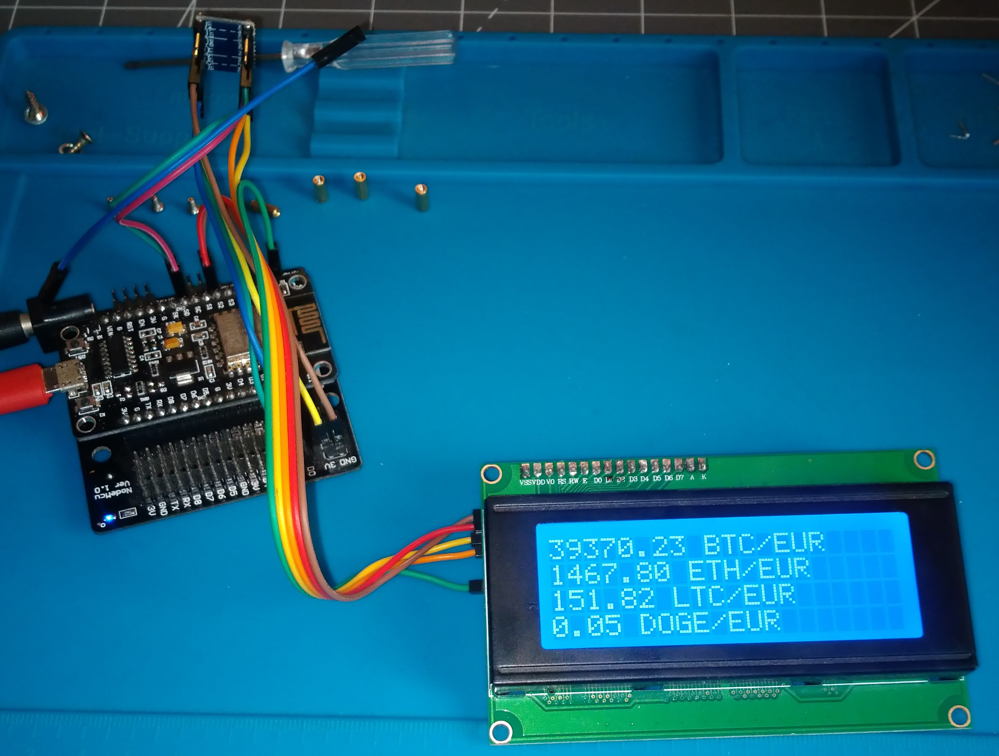
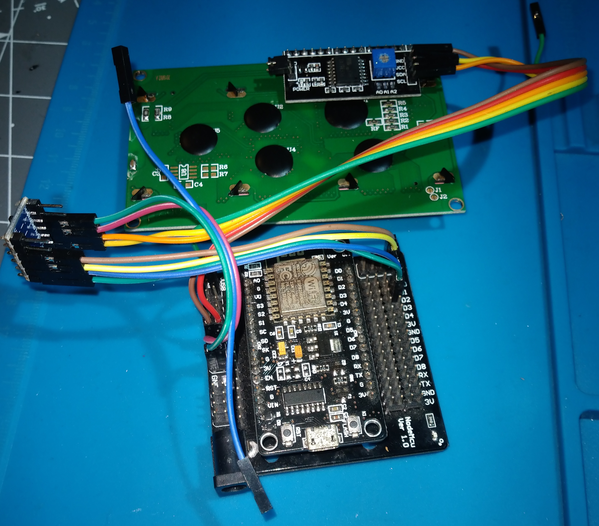

# Esp8266 Blockchain Tracing With Display

Shows Real Time Price of Cryptocurrencies on several Screens



## Video Tutorial

Work In Progress

## Hardware

- Display 2004A (20x4)
- Converter i2c
- Bi-Directional Logic Level Converter (Display at 5v, i2c at 3'3v)
- Esp8266 NodeMcu V3
- Voltage Input 3V for esp8266 and 5V for display

## Libreries and dependencies

In my case I use vscodium with the package for platformio.

Before start, need add to IDE:

- arduino-libraries/WiFi
- arduino-libraries/ArduinoHttpClient@^0.4.0
- marcoschwartz/LiquidCrystal_I2C@^1.1.4
- bblanchon/ArduinoJson@^6.17.2

## Prepare project

Copy file **src/api.cpp.example** to **src/api.cpp**.

```bash
cd esp8266-blockchain-tracing-with-display
cp src/api.cpp.example src/api.cpp
```

And set your values:

```c++
#define AP_NAME "AccesPointName"
#define AP_PASSWORD "Wireless_password"
#define API_DOMAIN "https://myweb.com"
#define API_PORT "443"
#define API_PATH "api/v1"
#define API_TOKEN_BEARER ""
```

No need bearer token, but need internet AP configuration and API for request data.

You can use external API for example API Binance or other public API.

## Connections

The connections are very simple but they can vary in different esp8266 models so you should check the diagram for yours.

In my case, connect i2c on pins **D1** and **D2**.

It is not a complex circuit.

Even so, it is necessary to bear in mind that the screen works at 5v and the esp8266 works at 3.3v.

We cannot directly connect the screen to the i2c if we power it with 5v.

If we feed the screen with 3.3v it is very possible that it is not very visible.

To solve this, we use the converter that ensures work with these two different voltages.

### Circuit 5V

We power the screen and the Bi-Directional Logic Level Converter with 5v. in the 5v part, we also connect SDA and SCL on one channel (not directly to 5v, but on that side but on a separate pin).

### Circuit 3,3V

We connect sda and scl from esp8266 to the Bi-Directional Logic Level Converter. 

We also power this part of the Bi-Directional Logic Level Converter with 3.3v (it can be connected to esp8266 directly).




## 3D print box

Work In Progress
